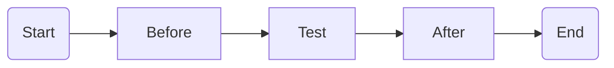

# Hooks

In many tests, you’ll have to write code that performs a setup, such as
starting an application, or cleans up after the test has run. This is
where hooks come in.



## `before`

To run code before _all_ tests in the current scope, add a `before`
block:

```php
describe(Car::class, function () {
  context('when unlocked', function () {
    before(function () {
      unlock_car();
    });

    it('allows doors to be opened', function () {
      // car is unlocked but has an empty tank
    });
  });

  context('with a full tank', function () {
    before(function () {
      refuel_car();
    });

    it('can start its engine', function () {
      // car is refueled but not unlocked
    });
  });
})
```

If an exception is thrown inside a `before` hook, the test will be marked
as a failure.

## `after`

The `after` hook works like the `before` hook, except that it runs after
a test. It even executes if an exception occurred during a test to ensure
that resources are freed or that the application is reset to not cause
secondary, unrelated test failures.

```php
describe('Modem', function () {
  it('dials up', function () {
  });

  after(function () {
    disconnect_all_modems();
  });
});
```
